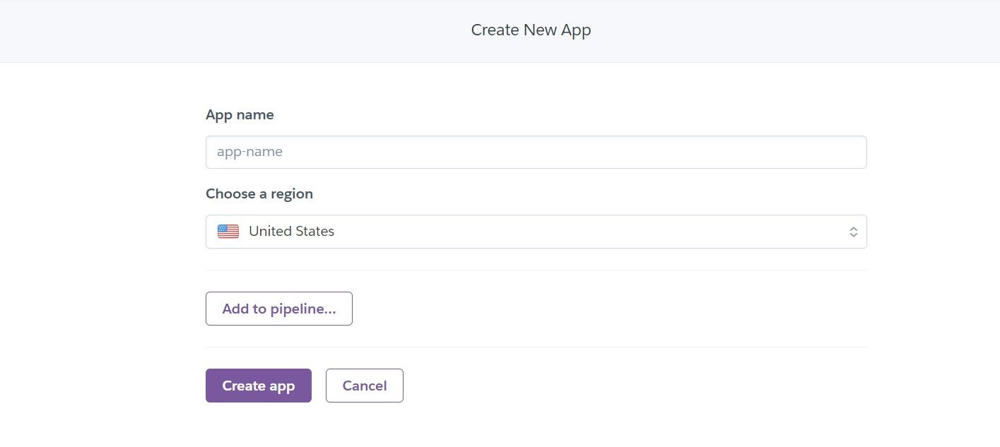

## Table of Contents

- [Executive Summary](#executive-summary)
  - [Market Analysis](#market-analysis)
  - [Marketing and Sales Strategy](#marketing-and-sales-strategy)
  - [Operations and Management](#operations-and-management)
  - [Financial Plan](#financial-plan)
  - [Conclusion](#conclusion)
- [Marketing](#marketing)
  - [Social Media](#social-media)
  - [Mailing List](#mailing-list)
- [User Goals](#user-goals)
- [Site Owner Goals](#site-owner-goals)
- [User Experience](#user-experience)
- [User Stories](#user-stories)
- [Wireframes](#wireframes)
- [Design](#design)
  - [Colors](#colors)
  - [Fonts](#fonts)
  - [Structure](#structure)
    - [Website pages](#website-pages)
    - [AWS](#aws)
    - [Database](#database)
    - [Models](#models)
- [Technologies Used](#technologies-used)
- [Features](#features)
- [Validation](#validation)
- [Testing](#testing)
  - [Manual testing](#manual-testing)
  - [Automated testing](#automated-testing)
  - [Tests on various devices](#tests-on-various-devices)
  - [Browser compatibility](#browser-compatibility)
- [Bugs](#bugs)
- [Deployment](#deployment)
- [Credits](#credits)
- [Acknowledgements](#acknowledgements)

## Business Plan

### Executive Summary:

ThrottleMotocross is a web-based platform that connects bikers to store and share tips and tricks. It offers a convenient ecommerce store for purchasing motocross products. In addition, ThrottleMotocross features a blog with the latest news and tips on the Motocross culure, as well as a contact page for inquiries and support.

Our target market is Motocross bikers of all skill levels and demographics, as well as beginners looking for a streamlined solution to het start and get some of the latest product on the market. We aim to differentiate ourselves from competitors by offering a more user-friendly and intuitive platform.

In terms of revenue, ThrottleMotocross will generate income through the sale of products in our ecommerce store. We will also explore potential partnerships and sponsorships with bike-related brands to further monetize the platform.

Overall, ThrottleMotocross aims to become the go-to destination for Motocross enthusiast.

### Market Analysis:

The golf industry is a multi-billion euro industry, with a large and dedicated consumer base. While traditional methods of booking tee times (such as calling the club or booking in-person) are still popular, there is a growing trend towards online booking platforms. This shift towards online booking presents a significant opportunity for Teetime to establish itself as a leading player in the market.

ThrottlerMotocross will face other online Motocross but, we believe that our user-friendly platform and wide range of products in our ecommerce store will differentiate us from competitors and make us a preferred choice for Motocross bikers.

### Marketing and Sales Strategy:

ThrottleMotocross will utilize a combination of online and offline marketing tactics to reach our target market. These tactics will include:

Online advertising through social media platforms such as Facebook and Instagram
Content marketing through our blogs
Partnerships and sponsorships with golf-related brands
Public relations efforts to generate press coverage and raise awareness of ThrottleMotocross.
In terms of sales, our primary focus will be on converting website visitors into customers through the use of persuasive copy and calls-to-action.

### Operations and Management:

ThrottlesMotocross will be operated and managed by a small team of experienced professionals. The team will consist of a CEO, CTO, and marketing and sales staff.

In terms of operations, we will utilize a cloud-based platform to host the website and software, as well as a payment gateway for processing transactions. We will also utilize third-party fulfillment centers to handle the storage, packing, and shipping of products purchased through our ecommerce store.

#### Financial Plan:

ThrottlesMotocross will generate revenue through the sale of products in our ecommerce store. In terms of expenses, the main cost will be marketing and advertising efforts to drive traffic to the website and attract customers.

ThrottlesMotocross will initially be funded through a combination of personal investment and a small seed round of funding. As the business grows, we will explore additional funding options such as venture capital or a larger round of financing.

In terms of profitability, we expect to break even within the first year of operation and achieve profitability in the second year.

### Conclusion:

ThrottlesMotocross is a unique and innovative platform that aims to connect with Motocross rider to find whatever suits their need while connecting and sharing tricks and tips With strong growth potential and a clear revenue model, we believe that ThrottlesMotocross has the potential to become a leading player in the Motoctoss industry.

## Marketing

### Social Media

The web app "throttlesmotocross" has a presence on both Facebook and Instagram. The Facebook page serves as a platform to promote post updates on the future plans and products, and share user-generated content. This social media account allow users to stay informed and connected with the "throttlesmotocross" community.

## Website pages

- The site consists of the following pages:
  - Home
  - Product List
  - Product Expanded
  - Cart
  - Checkout
  - Checkout Success
  - Blog
  - Blog expanded
  - Contact
  - Register
  - Profile
  - Login
  - Logout
  - Reset Password
  - Register
  - 404

## AWS

I am using AWS S3 buckets to store my data. S3 is a highly scalable and durable cloud storage service provided by Amazon Web Services. It allows me to easily store and retrieve large amounts of data, and its built-in security features provide added protection for my files. I chose S3 for its scalability, durability, and security features.

See AWS Images

## Database

I built my database using PostgreSQL. It's a powerful and open-source object-relational database system that is known for its reliability, robustness, and performance. I chose it because it provides a flexible tool for efficiently managing and organizing my data.

See Database Image

# Structure

The site was designed for the user to be familiar with the layout such as a navigation bar along the top of the pages and a hamburger menu button for smaller screen.

The footer contains all relevant social media links that the business has so the user can visit any social media site and follow the business there to expand the businesses followers, likes and shares.
It contains an email sign up form and useful links as well as contact information.

### User Goals

- To browse and purchase a wide range of products throught the Motocross e-commerce store
- To access the lates Motocross news and tips through the Motocross blog
- To contact Throttlers MC team with any questions or support needed through the contact page

### Site Owner Goals

- Generate revenue through sales from the e-commerce store and help users get little motocross tricks and tips
- Build a strong and loyal customer base by providing an easy-to-use platform and high-quality products
- Sustain profitabiliy and maintain long-term growth
- Establish Throttlers MC as a trusted and go to brand in the Motocross community

## User Experience

### Target Audience

- Motocross racing professional who needs quality parts, bikes, gear, etc.
- Motocross enthusias who ride for fun and are in need of quality product without the stress of driving to a store
- Motocross beginners who needs tips and information to get started (this can be acheive via site blog)
- Individuals who want to be appart of a Motocross club/community

### User Reqirements and Expectaions

- Good customer service where users will expect the app to have good customer service, including responsive and helpful support in the event of any issues or questions.
- Accessible site
- Security where users will expect their personal and financial information to be secure when using the app, and will expect the app to have appropriate measures in place to protect their data.
- Reliability where users will expect the app to be reliable and function smoothly, without any errors or technical issues.
- A user-friendly interface users will expect the app to be easy to navigate and use, with clear and concise instructions on purchasing products.
- A wide selection of products with discriptions, details and competitive prices

### User Stories

#### User

##### Registration/User Account

1. As a user I can view home page so that see what the site is about
2. As a site user I can register so that I can become a member
3. As a site user I can create a user profile so that shop easily, get benefits and special access
4. As a return user I can login/logout so that I do not need to register every time and my information is remembered
5. As a site user I can logout so that I can leave site and my information is protected
6. As a site user I can receive emails confirmation so that notify of registration success
7. As a site user I can recover my password so that I can create a new password If I can't remember password

##### Viewing/Navigation

8. As a site user I can easily navigate through the site so that see and access all site features
9. As a site user I can get notifications so that I know my actions are successful or failed
10. As a site user I can see my login status so that I can know if I am logged in or out
11. As a site user I can access social media links so that visit store social media site
12. As a shopper I can got to site store so that I can shop products
13. As a shopper I can view my cart items so that I know the cost
14. As a shopper I can view product list so that I can see what products are available
15. As a shopper I can view a specific product detail so that I can get more information about the product

##### Sort/Searching

16. As a shopper I can search product by name/description so that I don not have to scroll and product is found quicker if it exists
17. As a shopper I can sort product by category so that I can easily find the product I'm looking for
18. As a shopper I can sort product by high and low prices so that I can find the best value for my money

##### Purchase/Checkout

19. As a site user I can view my cart at any time so that see what I am buying and the cost
20. As a shopper I can use card as payment method so that complete my purchase
21. As a shopper I can change item quantity or size in cart so that I can change item if needed
22. As a shopper I can select size or quantity for product so that so I get what I need
23. As a shopper I can receive order confirmation so that I can be notified of successful order
24. As a site user I can receive emails confirmation so that notify of registration success

##### Admin/Store Management

25. As a site owner I can add product so that I can display new products on the market
26. As a site owner I can edit products so that I display discount or product availability
27. As a site owner I can delete products so that I can control my available products

##### Blog

28. As a site user I can Contact Administration so that ask questions or give inquiries
29. As a site owner I can have a blog so that topics can be posted to be commented on
30. As a site user I can comment on blog so that my opinions can be seen
31. As a site user I can access blog details so that read blog information

### Kanban & Epic

- GitHub Kanban was used to track all open user stories
- Epic was created using the milestones feature

Epic 2

Epic 3

Epic 4

Epic 5

Epic 6

Kanban

### Wireframes

Home

Products

Blog

Contact

Cart

Registration

Login

## Models

### User Model

| Key        | Name         | Type        |
| ---------- | ------------ | ----------- |
| PrimaryKey | user_id      | AutoField   |
|            | password     | VARCHAR(45) |
|            | last_login   | VARCHAR(45) |
|            | is_superuser | BOOLEAN     |
|            | username     | VARCHAR(45) |
|            | first_name   | VARCHAR(45) |
|            | last_name    | VARCHAR(45) |
|            | email        | VARCHAR(45) |
|            | is_staff     | BOOLEAN     |
|            |              |             |
|            | is_active    | BOOLEAN     |
|            | date_joined  | VARCHAR(45) |

### User Profile Model

| Key        | Name                 | Type          |
| ---------- | -------------------- | ------------- |
| PrimaryKey | user_profile_id      | AutoField     |
| ForeignKey | user                 | User model    |
|            | default_phone_number | CharField[20] |
|            | default_address1     | CharField[80] |
|            | default_address2     | CharField[80] |
|            | default_town_city    | CharField[40] |
|            | default_county       | CharField[80] |
|            | default_postcode     | CharField[20] |
|            | default_country      | CharField[40] |

### Product Model

| Key        | Name        | Type           |
| ---------- | ----------- | -------------- |
| PrimaryKey | product_id  | AutoField      |
|            | code        | CharField[50]  |
|            | brand       | CharField[50]  |
|            | name        | CharField[50]  |
|            | description | TextField      |
|            | has_sizes   | BooleanField   |
|            | price       | DecimalField   |
| ForeignKey | category    | Category model |
|            | rating      | DecimalField   |
|            | image       | ImageField     |

### Category Model

| Key        | Name          | Type      |
| ---------- | ------------- | --------- |
| PrimaryKey | category_id   | AutoField |
|            | name          | Char[254] |
|            | friendly_name | Char[254] |

### Order Model

| Key        | Name          | Type               |
| ---------- | ------------- | ------------------ |
| PrimaryKey | order_id      | AutoField          |
|            | order_number  | CharField[40]      |
| ForeignKey | user_profile  | User profile Model |
|            | full_name     | CharField[50]      |
|            | email         | EmailField[254]    |
|            | phone_number  | CharField[20]      |
|            | address1      | CharField[80]      |
|            | address2      | CharField[80]      |
|            | town_city     | CharField[40]      |
|            | postcode      | CharField[20]      |
|            | county        | CharField[80]      |
|            | country       | CharField[40]      |
|            | date          | DateTimeField      |
|            | delivery_cost | DecimalField[6]    |
|            | order_total   | DecimalField[10]   |
|            | grand_total   | DecimalField[10]   |
|            | original_cart | TextField          |
|            | stripe_pid    | CharField          |

### OrderLineItem Model

| Key        | Name             | Type            |
| ---------- | ---------------- | --------------- |
| PrimaryKey | OrderLineItem_id | AutoField       |
| ForeignKey | order            | Order Model     |
| ForeignKey | product          | Product Model   |
|            | product_size     | CharField[2]    |
|            | quantity         | IntegerField    |
|            | line_item_total  | DecimalField[6] |

### Post Model

| Key        | Name           | Type                |
| ---------- | -------------- | ------------------- |
|            | title (unique) | Char[200]           |
|            | slug (unique)  |                     |
| PrimaryKey | post_id        | AutoField           |
| ForeignKey | author         | User model          |
|            | created_date   | DateTime            |
|            | updated_date   | DateTime            |
|            | content        | TextField           |
|            | featured_image | Cloudinary image |
|            | excerpt        | TextField           |
|            | status         | Integer             |

### Comment Model

| Key        | Name         | Type                                   |
| ---------- | ------------ | -------------------------------------- |
| ForeignKey | post         | Post model Cascade on delete     |
|            | name         | CharField[80]                          |
|            | email        | EmailField                             |
|            | body         | TextField                              |
|            | created_date | DateTimeField auto*now* add_true |
|            | approved     | BooleanField default False          |
|            |              |                                        |
|            |              |                                        |
|            | Meta         | created_on                             |

### ContactUs Model

| Key        | Name         | Type             |
| ---------- | ------------ | ---------------- |
| PrimaryKey | message_id   | AutoField        |
|            | created_date | DateTimeField    |
| ForeignKey | user         | User model       |
|            | name         | CharField        |
|            | email        | EmailField       |
|            | phone        | PhoneNumberField |
|            | body         | TextField        |

## Technologies Used

### Languages & Frameworks

- HTML
- CSS
- Javascript
- Python
- Django

### Libraries & Tools

- [Am I Responsive](http://ami.responsivedesign.is/)
- [Balsamiq](https://balsamiq.com/)
- [Bootstrap v5.2](https://getbootstrap.com/)
- [Cloudinary](https://cloudinary.com/)
- [Favicon.io](https://favicon.io)
- [Chrome dev tools](https://developers.google.com/web/tools/chrome-devtools/)
- [Font Awesome](https://fontawesome.com/)
- [Git](https://git-scm.com/)
- [GitHub](https://github.com/)
- [Google Fonts](https://fonts.google.com/)
- [Heroku Platform](https://id.heroku.com/login)
- [AWS](https://aws.amazon.com/)
- [jQuery](https://jquery.com)
- [Postgres](https://www.postgresql.org/)
- [Summernote](https://summernote.org/)
- Validation:
  - [WC3 Validator](https://validator.w3.org/)
  - [Jigsaw W3 Validator](https://jigsaw.w3.org/css-validator/)
  - [JShint](https://jshint.com/)
  - [CI Python Liner(PEP8)](https://pep8ci.herokuapp.com/)
  - [Lighthouse](https://developers.google.com/web/tools/lighthouse/)
  - [Wave Validator](https://wave.webaim.org/)

## Features

### Search Engine Optimisation (SEO)

I have used meta tags in the HTML of my web app's pages to optimize them for search engines. The description tag provides a brief summary of the content on the page, while the keywords tag lists relevant keywords to help search engines understand the content of the webpage and its relevance to related search queries.

See feature image

### Logo and Navigation Bar

- Site Logo supports the wild life theme of the site and navigates to home page
- The navbar is consist of the logo and the links to all the site feature
- The navbar is present on all pages
- The navbar also have a drop down features login, register and booking

See feature images

### Home page

- The home page is consist og images and descriptions relating to wildlife
- The home page is also consist of a button to navigate to register and a button enroll

See feature images

### Footer

- The footer is consist of social media link
- The footer also have office location and contact information
- the footer is displayed at the bottom of the page

See feature images

### Sign up/Register

- The registration page is consist of a form to enter user details
- It prupose is for new users to access more site features
- The form also instructions on how to register

See feature images

### Login

- Easy for return users to get in
- Fields are mandatory

See feature images

### Logout

- User can log out before leaving the site

See feature images

### Store

- View and select site products to purchase

See feature images

### Product details

- See discription and availablity of products

See feature images

### Add product

- Add selected product to shopping cart

See feature images

### Edit product

- Site owner can edit product description and availablity
- Submit and update message will be seen

See feature images

### Cart

- View cart to see what you are buying and your totyal cost of items to purchase

See feature images

### Contact page

- User can contact us by filling out this form
- User must enter their names and email and the message in the text field
- Message will display when the form is submitted

See feature images

### Blog

- Fully responsive
- Display blog posts made by staff/organisation
- Blog post are paginated
- Click on the post to read the post details

See feature images

### Blog details

- Blog details show more detials about the blog
- The featured image is displayed

See feature images

### Blog commenting

- only registered or logged in User get the option to leave comment
- Comment cand be done in the text field but needs to be approved
- When commented are made the submitted the comment awiting approval message is displayed
- Comments are approved by staff/organisation for monitering purposes

See feature images

### Profile

- Create a profile to be apart of Throttlers MC

See feature images

### Comfirmation pages

- Confirmation of transactions and registration

See feature images

See feature images

### Popup confirmations

See feature images

### Checkout page

- Review purchase and payment details

See feature images

### 404 page

## Validation

### HTML Validation

- The W3C Markup Validation Service was used to validate the HTML of the website.

Home

Products

Blog

Contact

Cart

Signup

Login

Profile

Checkout

### CSS Validation

- The W3C Jigsaw service was used for CSS Validation.

base.css

checkout.css

profile.css

### JavaSript Validation

- The JSHint JS Validation Service was used to validate the Javascript.

checkout.js

stripe.js

### Pep8 Validation

- PEP8 Validation Service was used to check the code for PEP8 requirements.

#### Homeapp

urls.py

view.py

#### Cartapp

admin.py

forms.py

models.py

tests.py

urls.py

view.py

#### Productsapp

admin.py

models.py

widgets.py

urls.py

view.py

#### checkoutapp

admin.py

forms.py

models.py

tests.py

urls.py

view.py

#### Blog app

admin.py

forms.py

models.py

tests.py

urls.py

view.py

#### Profilesapp

forms.py

models.py

urls.py

view.py

#### Contactapp

admin.py

forms.py

models.py

urls.py

view.py

### Chrome ligthouse tool

- Lighthouse was used to test the performance, accessibility, best practice and SEO of the site.

#### Mobile

View results

| Page                                | Performance (%) | Accessibility (%) | Best Practices (%) | SEO (%) |
| ----------------------------------- | --------------- | ----------------- | ------------------ | ------- |
| home/templates/home/index.html      | 91              | 100               | 92                 | 100     |
| home/templates/home/contact.html    | 93              | 97                | 100                | 100     |
| programs/templates/programs/        | 98              | 100               | 100                | 100     |
| programs/templates/programs/        | 92              | 97                | 92                 | 100     |
| booking/templates/booking/          | 94              | 97                | 100                | 100     |
| booking/templates/booking/          | 97              | 98                | 100                | 100     |
| booking/templates/booking/          | 94              | 98                | 92                 | 100     |
| booking/templates/booking/          | 98              | 93                | 100                | 100     |
| blog/templates/blog/blog_list.html  | 87              | 98                | 83                 | 100     |
| blog/templates/blog/blog_story.html | 87              | 98                | 83                 | 100     |
| templates/account/login.html        | 98              | 100               | 92                 | 100     |
| templates/account/logout.html       | 99              | 100               | 92                 | 100     |
| templates/account/signup.html       | 99              | 100               | 92                 | 100     |

#### Desktop

View results

| Page                                | Performance (%) | Accessibility (%) | Best Practices (%) | SEO (%) |
| ----------------------------------- | --------------- | ----------------- | ------------------ | ------- |
| home/templates/home/index.html      | 99              | 100               | 92                 | 100     |
| home/templates/home/contact.html    | 100             | 100               | 92                 | 100     |
| programs/templates/programs/        | 100             | 100               | 92                 | 100     |
| programs/templates/programs/        | 99              | 96                | 92                 | 100     |
| booking/templates/booking/          | 100             | 100               | 92                 | 100     |
| booking/templates/booking/          | 100             | 93                | 92                 | 100     |
| booking/templates/booking/          | 100             | 93                | 92                 | 100     |
| booking/templates/booking/e         | 100             | 93                | 92                 | 100     |
| blog/templates/blog/blog_list.html  | 87              | 98                | 83                 | 100     |
| blog/templates/blog/blog_story.html |                 | 98                | 92                 | 100     |
| templates/account/login.html        | 100             | 100               | 92                 | 90      |
| templates/account/logout.html       | 100             | 100               | 92                 | 100     |
| templates/account/signup.html       | 100             | 100               | 92                 | 100     |

### Waves

- The WAVE WebAIM web accessibility evaluation tool was used to test the websites accessibility.
- Wave accessibilty issues with heroku connection cause some page not to be tested

#### Desktop

Home

Store

Contact Us

Blog

Blog details

Register

Login

Logout

### Manual testing

1. As a site user I want to see a Motocross scheme to site

   | **Step**                                                                  | **Expected result**                                                   | **Actual Result** |
   | ------------------------------------------------------------------------- | --------------------------------------------------------------------- | ----------------- |
   | Visit page:https://ci-pp5-throttles-motocross-2c6aa11127d2.herokuapp.com/ | Home page tells about the wht the site represent with photos to match | Work as Expected  |

   

Screenshots

   
   

2. As a site user I can register so that I can become a member

| Feature | Action                                                                       | Expected Result                     | Actual Result     |
| ------- | ---------------------------------------------------------------------------- | ----------------------------------- | ----------------- |
| Sign Up | Click pofile button and select register, user is brought to the sign up page | User is brought to the sign up page | Works as expected |

See Images

3. As a site user I can create a user profile so that shop easily, get benefits and special access

| Feature | Action                                                                                                                                        | Expected Result            | Actual Result     |
| ------- | --------------------------------------------------------------------------------------------------------------------------------------------- | -------------------------- | ----------------- |
| Profile | Login, From the Nav click the profile icon, select profile from dropdown and be broought to the profile page where user information is stored | Be brought to profile page | Works as expected |

See Images

4. As a return user I can login/logout so that I do not need to register every time and my information is remembered

| Feature | Action                                                                    | Expected Result                     | Actual Result     |
| ------- | ------------------------------------------------------------------------- | ----------------------------------- | ----------------- |
| Sign In | Click pofile button and select login, user is brought to the sign in page | User is brought to the sign in page | Works as expected |

See Images

5. As a site user I can receive emails confirmation so that notify of registration success

| Feature      | Action                                                                   | Expected Result                                                            | Actual Result     |
| ------------ | ------------------------------------------------------------------------ | -------------------------------------------------------------------------- | ----------------- |
| Registration | Upon registration an email is sent to verify the email address submitted | Registration email arrives into inbox of the email address used to sign up | Works as expected |

See Images

6. As a site user I can recover my password so that I can create a new password If I can't remember password

| Feature        | Action                                                                                                                        | Expected Result                        | Actual Result     |
| -------------- | ----------------------------------------------------------------------------------------------------------------------------- | -------------------------------------- | ----------------- |
| Reset Password | Click pofile button and select login, user is brought to the sign in page, click forgot password to go to password reset page | User is brought to password reset page | Works as expected |

See Images

7. As a site user I can easily navigate through the site so that see and access all site features

| Feature | Action                                                                              | Expected Result                                                                    | Actual Result     |
| ------- | ----------------------------------------------------------------------------------- | ---------------------------------------------------------------------------------- | ----------------- |
| Navbar  | Click on any link in the navbar to be brought to a relevant page, store for example | Be brought to store to view all products after clicking all products in the navbar | Works as expected |

See Images

8. As a site user I can get notifications so that I know my actions are successful or failed

| Feature   | Action                                 | Expected Result                                                                    | Actual Result     |
| --------- | -------------------------------------- | ---------------------------------------------------------------------------------- | ----------------- |
| Alert Box | Add an item from the store to the cart | A message will appear in the alert box on screen to notify the user of this action | Works as expected |

See Images

9. As a site user I can see my login status so that I can know if I am logged in or out

| Feature    | Action                                                                                               | Expected Result                               | Actual Result     |
| ---------- | ---------------------------------------------------------------------------------------------------- | --------------------------------------------- | ----------------- |
| Navigation | While logged out the profile icon in the navbar will be gray, log in it will change to a green color | Once logged in the profile icon will be green | Works as expected |

See Images

10. As a site user I can access social media links so that visit store social media site

| Feature       | Action                                       | Expected Result                                          | Actual Result     |
| ------------- | -------------------------------------------- | -------------------------------------------------------- | ----------------- |
| Navbar/Footer | Scoll to footer, click on the Instagram logo | A new tab will open and bring user to the Instagram page | Works as expected |

See Images

11. As a shopper I can got to site store so that I can shop products

| Feature | Action                                         | Expected Result                                            | Actual Result     |
| ------- | ---------------------------------------------- | ---------------------------------------------------------- | ----------------- |
| Store   | Click store in the navbar, select all products | User is then brought to the all products page of the store | Works as expected |

See Images

12. As a shopper I can view my cart items so that I know the cost

| Feature | Action                            | Expected Result                                                                                                 | Actual Result     |
| ------- | --------------------------------- | --------------------------------------------------------------------------------------------------------------- | ----------------- |
| Cart    | Click the cart icon in the navbar | User is brought to the cart page where all products in cart are displayed along with their price and total cost | Works as expected |

See Images

13. . As a shopper I can view product list so that I can see what products are available

| Feature    | Action                                            | Expected Result                                                                 | Actual Result     |
| ---------- | ------------------------------------------------- | ------------------------------------------------------------------------------- | ----------------- |
| Categories | Select a category on the side panel, select Bikes | User is brought to the selected category of product and all products are listed | Works as expected |

See Images

14. As a shopper I can view a specific product detail so that I can get more information about the product

| Feature        | Action                                                   | Expected Result                                                                | Actual Result     |
| -------------- | -------------------------------------------------------- | ------------------------------------------------------------------------------ | ----------------- |
| Product Detail | Click on any item image in the store, or the view button | User is brought to the product detail page where product details are displayed | Works as expected |

See Images

15. As a shopper I can search product by name/description so that I don not have to scroll and product is found quicker if it exists

| Feature | Action                                                                                 | Expected Result                                       | Actual Result     |
| ------- | -------------------------------------------------------------------------------------- | ----------------------------------------------------- | ----------------- |
| Search  | Search box in the navigation bar, input keyword to search such as "blue", click search | All items with the relevant keyword will be displayed | Works as expected |

See Images

16. As a shopper I can sort product by category so that I can easily find the product I'm looking for

| Feature | Action                                                          | Expected Result                                                                   | Actual Result     |
| ------- | --------------------------------------------------------------- | --------------------------------------------------------------------------------- | ----------------- |
| Sort    | From the store page, click a category on the side panel such as | User is brought to the headwear page where only products classed as are displayed | Works as expected |

See Images

17. As a shopper I can sort product by high and low prices so that I can find the best value for my money

| Feature | Action                                                                    | Expected Result                                                     | Actual Result     |
| ------- | ------------------------------------------------------------------------- | ------------------------------------------------------------------- | ----------------- |
| Sort    | From the store page, click the sort box and select price from high to low | All items will be sorted from the highest price to the lowest price | Works as expected |

See Images

18. As a site user I can view my cart at any time so that see what I am buying and the cost

| Feature | Action                            | Expected Result                                                                                                | Actual Result     |
| ------- | --------------------------------- | -------------------------------------------------------------------------------------------------------------- | ----------------- |
| Cart    | Click the cart icon in the navbar | The cart page will appear and display all items in the cart and their cost alongside total price for all items | Works as expected |

See Images

19. As a shopper I can use card as payment method so that complete my purchase

| Feature  | Action                               | Expected Result                                                                                      | Actual Result     |
| -------- | ------------------------------------ | ---------------------------------------------------------------------------------------------------- | ----------------- |
| Checkout | From the cart select secure checkout | Input user information, input card number 4242 4242 4242 4242 04/24 424 24242, payment is successful | Works as expected |

See Images

20. As a shopper I can change item quantity or size in cart so that I can change item if needed

| Feature         | Action                                                                                                                       | Expected Result                              | Actual Result     |
| --------------- | ---------------------------------------------------------------------------------------------------------------------------- | -------------------------------------------- | ----------------- |
| Product Details | From Product details page select a size for the product in the size box, increase or decrease quantity from the quantity box | Sizes will be selected and quantity adjusted | Works as expected |

See Images

21. As a shopper I can select size or quantity for product so that so I get what I need

| Feature | Action                                                                            | Expected Result                                | Actual Result     |
| ------- | --------------------------------------------------------------------------------- | ---------------------------------------------- | ----------------- |
| Cart    | From the cart press the increase/ decrease button to desired number, click update | The cart will update with the desired quantity | Works as expected |

See Images

22. As a shopper I can receive order confirmation so that I can be notified of successful order

| Feature   | Action                                                              | Expected Result                          | Actual Result     |
| --------- | ------------------------------------------------------------------- | ---------------------------------------- | ----------------- |
| Alert Box | Upon a successful checkout an alert box will be visible to the user | Alert box pops up with the order details | Works as expected |

See Images

23. As a site user I can receive emails confirmation so that notify of registration success

| Feature            | Action                                                                                                                             | Expected Result                       | Actual Result     |
| ------------------ | ---------------------------------------------------------------------------------------------------------------------------------- | ------------------------------------- | ----------------- |
| Email Confirmation | Upon a successful checkout a confirmation email will be sent to the provided email address which contains the details of the order | Email confirmation arrives into inbox | Works as expected |

See Images

24. As a site owner I CAN add product SO THAT I can display new products on the market

| Feature     | Action                                                                                               | Expected Result                                                                                  | Actual Result     |
| ----------- | ---------------------------------------------------------------------------------------------------- | ------------------------------------------------------------------------------------------------ | ----------------- |
| Add Product | From the navbar select the profile button as an admin logged in, click add product from the dropdown | The add product page will appear allowing the addition of a new product via the add product form | Works as expected |

See Images

25. As a site owner I can edit products so that I display discount or product availability

| Feature      | Action                                                                              | Expected Result                                                                         | Actual Result     |
| ------------ | ----------------------------------------------------------------------------------- | --------------------------------------------------------------------------------------- | ----------------- |
| Edit Product | From product detail as an admin account, find a edit button on the page, click edit | Admin is brought to the edit product page where they can adjust any part of the product | Works as expected |

See Images

26. As a site owner I can delete products so that I can control my available products

| Feature        | Action                                                                                  | Expected Result                                                               | Actual Result     |
| -------------- | --------------------------------------------------------------------------------------- | ----------------------------------------------------------------------------- | ----------------- |
| Delete Product | From product detail as an admin account, find a delete button on the page, click delete | A modal pops up and asks the admin to confirm they wish to delete the product | Works as expected |

See Images

27. As a site user I can Contact Administration so that ask questions or give inquiries

    | Step                             | Expected Result                                   | Actual Result     |
    | -------------------------------- | ------------------------------------------------- | ----------------- |
    | When loogedin click on 'Contact' | Contact form will be displayed with message field | Works as expected |

    

Screenshots

    
    
    

28. As a site owner I can have a blog so that topics can be posted to be commented on

| Step                 | Expected Result                  | Actual Result     |
| -------------------- | -------------------------------- | ----------------- |
| Go to blog on navbar | A list of blog post will display | Works as expected |

Screenshots

29. As a site user I can comment on blog so that my opinions can be seen

| Step                      | Expected Result                          | Actual Result     |
| ------------------------- | ---------------------------------------- | ----------------- |
| Login, click on blog post | Comment form will display for commenting | Works as expected |

Screenshots

30. As a site user I can access blog details so that read blog information

    | Step                               | Expected Result           | Actual Result     |
    | ---------------------------------- | ------------------------- | ----------------- |
    | Click on a blog image in blog list | Blog details will display | Works as expected |

    

Screenshots

    
    
    

## Bugs

List of bugs found and fixes used ti mitigate them.

- Bug:Stray div tags on base.html amd products.html
  Fix:Deleted stray tags
- Bug:Webhok was not working due to configuration
  Fix:Reset configurations

## Configuration

### Google emails

To set up the project to send emails and to use a Google account as an SMTP server, the following steps are required:

1. Create an email account at google.com, login, click you user icon and then on 'Manage Your Google Account'
2. Click on the Security tab
3. Turn on 2-step verification and follow the steps to enable
4. Click on App passwords, click on Select app and choose Other
5. Give your app a name and click on 'Generate'
    
6. A 16 digit password will be generated, note the password down
7. Set the below variables within the settings.py file to successfully send emails
    <code>EMAIL_BACKEND = 'django.core.mail.backends.smtp.EmailBackend'</code>
    <code>EMAIL_HOST = 'smtp.gmail.com'</code>
    <code>EMAIL_HOST_USER = os.environ.get('EMAIL_HOST_USER')</code>
    <code>EMAIL_HOST_PASSWORD = os.environ.get('EMAIL_HOST_PASSWORD')</code>
    <code>EMAIL_PORT = '587'</code>
    <code>EMAIL_USE_TLS = True</code>
8. Set up the variables EMAIL_HOST_USER and EMAIL_HOST_PASSWORD in your Render application Config vars

## Deployment

### Heroku

This application has been deployed from GitHub to Heroku by following the steps:

### Forking the GitHub Repository

1. Go to the GitHub repository
2. Click on Fork button in top right corner
3. You will then have a copy of the repository in your own GitHub account.

### Making a Local Clone

1. Go to the GitHub repository
2. Locate the Code button above the list of files and click it
3. Highlight the "HTTPS" button to clone with HTTPS and copy the link
4. Open Git Bash
5. Change the current working directory to the one where you want the cloned directory
6. Type git clone and paste the URL from the clipboard ($ git clone https://github.com/YOUR-USERNAME/YOUR-REPOSITORY)
7. Press Enter to create your local clone

[Back to Table Of Contents](#table-of-content)

### Heroku Deployment

[Official Page](https://devcenter.heroku.com/articles/git) (Ctrl + click)

This application has been deployed from Github using Heroku. Here's how:

1. Create an account at heroku.com

2. Create an app, give it a name similar to project name, and select a region

3. Under resources search for postgres, and add a Postgres database to the app

4. Create and ElephantSqul account and set up a plan with in your region
   

   
   

5. Copy Url database instance from Sql account and store it in the env.py enviroment variable (os.environ["DATABASE_URL"]="<copiedURL>")

6. Add a your secret key to env.py enviroment variable os.environ["SECRET_KEY"]="my_super^secret@key"

7. Import env.py to settings.py add Data base and sercert key variable to settings.py file

8. Add localhost, and to the ALLOWED_HOSTS variable in settings.py

9. Migrate change to manage.py

10. Add Secret key and Database url to Heroku Config vars

11. Add PORT 8000 to config vars to avoid deployment failure

12. Set DEBUG value to False

13. Set X_FRAME_OPTION ='SAMEORIGIN'

14. Run pip3 freeze > requirements.txt so that file are updated before deployment

15. Run "python3 manage.py showmigrations" to check the status of the migrations

16. Run "python3 manage.py migrate" to migrate the database

17. Check config vars for DISABLE_COLLECTSTATIC=1 is removed

18. Go to deploy in the Heroku app
    

    
    

19. Clik Deploy

20. View build logs for error
     

     
     

21. Click app to view website

## Credits

### Media

Media images were referenced from <a href="https://www.pexels.com/">Pexels</a> , <a href="https://unsplash.com/">Upsplash</a> and <a href="http://www.freepik.com/">Freepik</a>.

- [404-background](assets/images/404er.jpeg): <a href=" https://www.pexels.com/photo/an-apple-and-a-dumbbell-on-a-clipboard-8154260/" >Pexels</a>
  Photo by: <a href="https://www.pexels.com/@alesiakozik/">Alesia Kozik</a>
- [signup-page-background](assets/images/signupimage.jpeg): <a href="https://www.pexels.com/photo/          personal-male-trainer-with-overweight-female-client-in-fitness-center-6455927/">Pexels</a>
  Photo by: <a href="https://www.pexels.com/@julia-larson/">Julian Larson</a>
- [hero-image](assets/images/heroimage.jpg): <a href="https://www.freepik.com/premium-photo/sport-couple-doing-plank-exercise-workout-fitness-centrum-man-woman-practicing-plank-gym_17801349.htm">Freepik</a>
  Photo by: <a href= "https://www.freepik.com/author/weyo">Weyo</a>
- [crossfit-image](assets/images/crossfitsmall.jpg): <a href="https://unsplash.com/photos/h3D-RRvxfqE">Unsplash</a>
  Photo by: <a href="https://unsplash.com/@bastien_plu">Bastien Plu</a>
- [trainer-image](assets/images/trainer.jpeg): <a href="https://www.pexels.com/photo/ethnic-woman-exercising-with-battling-ropes-near-male-trainer-6455771/">Pexels</a>
  photo by: <a href= "https://www.pexels.com/@julia-larson/">Julian Larson</a>

### Code

## Acknowledgements

- Thanks and acknowlegement goes to my mentor Mo Shami great guidance.
- Acknowledge my brother Addan Mc Collin for support form a user's veiw
- Thanks to my girlfriend Hiba Salem for support and input on a user veiw
- Thankful to the SlacK
